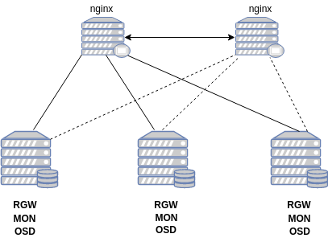
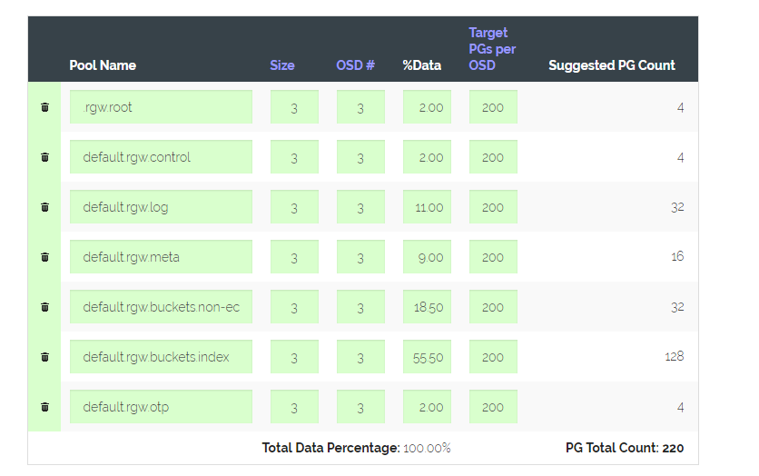
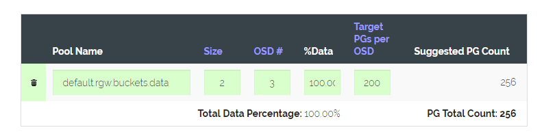

# Hướng dẫn cài đặt Ceph RGW Nautilus trên CentOS 7

## Mục lục

- 1. Mô hình
- 2. Cấu hình Ceph cluster
- 3. Cấu hình Ceph RGW
- 4. Cấu hình Nginx

### 1. Mô hình



### 2. Cấu hình Ceph cluster

Tham khảo [tại đây](ceph-deploy-nautilus-centos7.md)

### 3. Cấu hình Ceph RGW

- Thêm rule cho firewalld nếu bạn chưa disable

```
sudo firewall-cmd --zone=public --add-port 7480/tcp --permanent
sudo firewall-cmd --reload
```

- Cài đặt Ceph RGW

```
cd my-cluster
ceph-deploy rgw create ceph1 ceph2 ceph3
```

- Mặc định sẽ tạo ra 4 pool đó là

```
.rgw.root
default.rgw.control
default.rgw.meta
default.rgw.log
```

- Ta sẽ xóa toàn bộ các pool này đi

Đầu tiên cần bổ sung config cho phép xóa pool trong file `ceph.conf` ở thư mục `my-cluster`

```
cat << EOF >> ceph.conf

mon_allow_pool_delete = true
EOF
```

Sau đó push config sang các node khác

```
ceph-deploy --overwrite-conf config push ceph1 ceph2 ceph3
```

Restart lại service ceph-mon trên các node

`systemctl restart ceph-mon@$(hostname)`

Xóa toàn bộ các pool

```
ceph osd pool delete .rgw.root .rgw.root --yes-i-really-really-mean-it
ceph osd pool delete default.rgw.control default.rgw.control --yes-i-really-really-mean-it
ceph osd pool delete default.rgw.meta default.rgw.meta --yes-i-really-really-mean-it
ceph osd pool delete default.rgw.log default.rgw.log --yes-i-really-really-mean-it
```

Kiểm tra các osd hiện có

`ceph osd tree`

Tính toán để tạo ra các pool mới. Vì ở đây mình sử dụng SSD cho các service pool kèm với index và extra pool nên mình sẽ chia như sau





```
ceph osd pool create .rgw.root 4
ceph osd pool create hn.rgw.control 4
ceph osd pool create hn.rgw.log 32
ceph osd pool create hn.rgw.meta 16
ceph osd pool create hn.rgw.otp 4
ceph osd pool create hn.rgw.buckets.non-ec 32
ceph osd pool create hn.rgw.buckets.index 128
ceph osd pool create hn.rgw.buckets.data 256
```

Enable service application cho các pool vừa tạo

```
ceph osd pool application enable .rgw.root rgw
ceph osd pool application enable hn.rgw.control rgw
ceph osd pool application enable hn.rgw.log rgw
ceph osd pool application enable hn.rgw.meta rgw
ceph osd pool application enable hn.rgw.otp rgw
ceph osd pool application enable hn.rgw.buckets.non-ec rgw
ceph osd pool application enable hn.rgw.buckets.index rgw
ceph osd pool application enable hn.rgw.buckets.data rgw
```

Bổ sung config không cho phép tự động cập nhật crushmap trong file `ceph.conf` ở thư mục `my-cluster`

```
cat << EOF >> ceph.conf

osd_crush_update_on_start = false
EOF
```

Push config sang các node

`ceph-deploy --overwrite-conf config push ceph1 ceph2 ceph3`

Thực hiện restart lại ceph-mon service trên toàn bộ các node

`systemctl restart ceph-mon@$(hostname)`

Kiểm tra các osd ở trên cả 3 node

```
[root@ceph1 my-cluster]# ceph osd tree
ID CLASS WEIGHT  TYPE NAME      STATUS REWEIGHT PRI-AFF
-1       0.17014 root default
-3       0.09579     host ceph1
 0   hdd 0.04790         osd.0      up  1.00000 1.00000
 1   hdd 0.04790         osd.1      up  1.00000 1.00000
-5       0.05576     host ceph2
 2   hdd 0.01859         osd.2      up  1.00000 1.00000
 3   hdd 0.01859         osd.3      up  1.00000 1.00000
 4   hdd 0.01859         osd.4      up  1.00000 1.00000
-7       0.01859     host ceph3
 5   hdd 0.01859         osd.5      up  1.00000 1.00000
```

Giả sử 3 osd là `0,2,5` là ổ ssd, ta sẽ thay đổi crush map để các pool mong muốn sử dụng các ổ này

Đầu tiên, xóa bỏ device class của 3 osd trên và set cho chúng class mới

```
ceph osd crush rm-device-class osd.0
ceph osd crush rm-device-class osd.2
ceph osd crush rm-device-class osd.5

ceph osd crush set-device-class ssd osd.0
ceph osd crush set-device-class ssd osd.2
ceph osd crush set-device-class ssd osd.5
```

Kiểm tra lại

```
[root@ceph1 my-cluster]# ceph osd tree
ID CLASS WEIGHT  TYPE NAME      STATUS REWEIGHT PRI-AFF
-1       0.17014 root default
-3       0.09579     host ceph1
 1   hdd 0.04790         osd.1      up  1.00000 1.00000
 0   ssd 0.04790         osd.0      up  1.00000 1.00000
-5       0.05576     host ceph2
 3   hdd 0.01859         osd.3      up  1.00000 1.00000
 4   hdd 0.01859         osd.4      up  1.00000 1.00000
 2   ssd 0.01859         osd.2      up  1.00000 1.00000
-7       0.01859     host ceph3
 5   ssd 0.01859         osd.5      up  1.00000 1.00000
```

Kiểm tra các rule hiện có

`ceph osd crush rule ls`

Kết quả

`replicated_rule`

Dump chi tiết của 1 rule

```
[root@ceph1 my-cluster]# ceph osd crush rule dump
[
    {
        "rule_id": 0,
        "rule_name": "replicated_rule",
        "ruleset": 0,
        "type": 1,
        "min_size": 1,
        "max_size": 10,
        "steps": [
            {
                "op": "take",
                "item": -1,
                "item_name": "default"
            },
            {
                "op": "chooseleaf_firstn",
                "num": 0,
                "type": "host"
            },
            {
                "op": "emit"
            }
        ]
    }
]
```

Mặc định các pool được tạo sẽ sử dụng rule replicated_rule với rule_id:0

Tạo mới một bucket root mới

`ceph osd crush add-bucket ssd_disk root`

Kiểm tra

```
[root@ceph1 my-cluster]# ceph osd tree
ID  CLASS WEIGHT  TYPE NAME      STATUS REWEIGHT PRI-AFF
-13             0 root ssd_disk
 -1       0.17014 root default
 -3       0.09579     host ceph1
  1   hdd 0.04790         osd.1      up  1.00000 1.00000
  0   ssd 0.04790         osd.0      up  1.00000 1.00000
 -5       0.05576     host ceph2
  3   hdd 0.01859         osd.3      up  1.00000 1.00000
  4   hdd 0.01859         osd.4      up  1.00000 1.00000
  2   ssd 0.01859         osd.2      up  1.00000 1.00000
 -7       0.01859     host ceph3
  5   ssd 0.01859         osd.5      up  1.00000 1.00000
```

Create rule mới cho các ổ SSD

`ceph osd crush rule create-replicated ssd_rule ssd_disk host`

Kiểm tra

```
[root@ceph1 my-cluster]# ceph osd crush rule dump
[
    {
        "rule_id": 0,
        "rule_name": "replicated_rule",
        "ruleset": 0,
        "type": 1,
        "min_size": 1,
        "max_size": 10,
        "steps": [
            {
                "op": "take",
                "item": -1,
                "item_name": "default"
            },
            {
                "op": "chooseleaf_firstn",
                "num": 0,
                "type": "host"
            },
            {
                "op": "emit"
            }
        ]
    },
    {
        "rule_id": 1,
        "rule_name": "ssd_rule",
        "ruleset": 1,
        "type": 1,
        "min_size": 1,
        "max_size": 10,
        "steps": [
            {
                "op": "take",
                "item": -13,
                "item_name": "ssd_disk"
            },
            {
                "op": "chooseleaf_firstn",
                "num": 0,
                "type": "host"
            },
            {
                "op": "emit"
            }
        ]
    }
]
```

Tạo mới các bucket host cho các OSD ssd

```
ceph osd crush add-bucket ceph1_ssd host
ceph osd crush add-bucket ceph2_ssd host
ceph osd crush add-bucket ceph3_ssd host
```

Di chuyển các host vừa tạo vào root ssd_disk

```
ceph osd crush move ceph1_ssd root=ssd_disk
ceph osd crush move ceph2_ssd root=ssd_disk
ceph osd crush move ceph3_ssd root=ssd_disk
```

Di chuyển các OSD vào host tương ứng

```
ceph osd crush move osd.0 host=ceph1_ssd
ceph osd crush move osd.2 host=ceph2_ssd
ceph osd crush move osd.5 host=ceph3_ssd
```

Kiểm tra

```
[root@ceph1 my-cluster]# ceph osd tree
ID  CLASS WEIGHT  TYPE NAME          STATUS REWEIGHT PRI-AFF
-13       0.08507 root ssd_disk
-14       0.04790     host ceph1_ssd
  0   ssd 0.04790         osd.0          up  1.00000 1.00000
-15       0.01859     host ceph2_ssd
  2   ssd 0.01859         osd.2          up  1.00000 1.00000
-16       0.01859     host ceph3_ssd
  5   ssd 0.01859         osd.5          up  1.00000 1.00000
 -1       0.08507 root default
 -3       0.04790     host ceph1
  1   hdd 0.04790         osd.1          up  1.00000 1.00000
 -5       0.03717     host ceph2
  3   hdd 0.01859         osd.3          up  1.00000 1.00000
  4   hdd 0.01859         osd.4          up  1.00000 1.00000
 -7             0     host ceph3
```

Nếu weight và reweight chưa đúng, thay đổi các thông số này thông qua câu lệnh

```
ceph osd reweight osd.0 1
ceph osd crush reweight osd.0 0.04790
```

Chỉnh lại size cho pool data

`ceph osd pool set hn.rgw.buckets.data size 2`

Chỉnh lại rule cho các pool sử dụng ssd

```
ceph osd pool set .rgw.root crush_rule ssd_rule
ceph osd pool set hn.rgw.control crush_rule ssd_rule
ceph osd pool set hn.rgw.log crush_rule ssd_rule
ceph osd pool set hn.rgw.meta crush_rule ssd_rule
ceph osd pool set hn.rgw.otp crush_rule ssd_rule
ceph osd pool set hn.rgw.buckets.non-ec crush_rule ssd_rule
ceph osd pool set hn.rgw.buckets.index crush_rule ssd_rule
```

Kiểm tra

`ceph osd pool ls detail`

```
pool 7 '.rgw.root' replicated size 3 min_size 2 crush_rule 1 object_hash rjenkins pg_num 4 pgp_num 4 autoscale_mode warn last_change 102 flags hashpspool stripe_width 0 application rgw
pool 8 'hn.rgw.control' replicated size 3 min_size 2 crush_rule 1 object_hash rjenkins pg_num 4 pgp_num 4 autoscale_mode warn last_change 103 flags hashpspool stripe_width 0 application rgw
pool 9 'hn.rgw.log' replicated size 3 min_size 2 crush_rule 1 object_hash rjenkins pg_num 32 pgp_num 32 autoscale_mode warn last_change 105 flags hashpspool stripe_width 0 application rgw
pool 10 'hn.rgw.meta' replicated size 3 min_size 2 crush_rule 1 object_hash rjenkins pg_num 16 pgp_num 16 autoscale_mode warn last_change 106 flags hashpspool stripe_width 0 application rgw
pool 11 'hn.rgw.otp' replicated size 3 min_size 2 crush_rule 1 object_hash rjenkins pg_num 4 pgp_num 4 autoscale_mode warn last_change 107 flags hashpspool stripe_width 0 application rgw
pool 12 'hn.rgw.buckets.non-ec' replicated size 3 min_size 2 crush_rule 1 object_hash rjenkins pg_num 32 pgp_num 32 autoscale_mode warn last_change 108 flags hashpspool stripe_width 0 application rgw
pool 13 'hn.rgw.buckets.index' replicated size 3 min_size 2 crush_rule 1 object_hash rjenkins pg_num 128 pgp_num 128 autoscale_mode warn last_change 111 flags hashpspool stripe_width 0 application rgw
pool 14 'hn.rgw.buckets.data' replicated size 2 min_size 2 crush_rule 0 object_hash rjenkins pg_num 256 pgp_num 256 autoscale_mode warn last_change 86 flags hashpspool stripe_width 0 application rgw
```

- Tạo realm `vn`

`radosgw-admin realm create --rgw-realm=vn --default`

- Tạo zone group `hn`

`radosgw-admin zonegroup create --rgw-zonegroup=vn --master --default`

- Tạo zone `hn1`

`radosgw-admin zone create --rgw-zonegroup=vn --rgw-zone=hn --master --default`

- Update commit

`radosgw-admin period update --commit`

- Trỏ dns tới ip vip của nginx sau này


### 4. Cấu hình Nginx

#### 4.1 Cấu hình nginx trên cả 2 node

- Cài đặt

```
yum install epel-release -y
yum install nginx -y
```

- Start

`systemctl enable --now nginx`

- Cấu hình virtual host cho rgw

```
cat << EOF >> /etc/nginx/conf.d/radosgw.conf
upstream radosgw{
  server 192.168.62.11:7480;
  server 192.168.62.12:7480;
  server 192.168.62.13:7480;
}

server {

        listen 80;
        server_name *.cloudchuanchi.com;

        location / {
                proxy_set_header X-Real-IP $remote_addr;
                proxy_set_header X-Forwarded-For $proxy_add_x_forwarded_for;
                proxy_set_header Host $host;
                proxy_set_header X-Forwarded-Proto $scheme;
                proxy_pass http://radosgw;
                client_max_body_size 0;
        }
}
EOF
```

- Check và reload nginx

```
nginx -t
nginx -s reload
```

- Thêm config vào file `ceph.conf` trong thư mục `my-cluster`

```
[client.rgw.ceph1]
host = ceph1
rgw dns name = s3.cloudchuanchi.com

[client.rgw.ceph2]
host = ceph2
rgw dns name = s3.cloudchuanchi.com

[client.rgw.ceph3]
host = ceph3
rgw dns name = s3.cloudchuanchi.com
```

Sau đó chuyển cấu hình qua 3 node và thực hiện restart lại service radosgw

```
ceph-deploy --overwrite-conf config push ceph1 ceph2 ceph3
systemctl restart ceph-radosgw@rgw.$(hostname -s)
```

- Truy cập vào địa chỉ `s3.cloudchuanchi.com` và kiểm tra


- Cài đặt keepalived

`yum install -y keepalived`

- Thêm sysctl conf

```
echo "net.ipv4.ip_nonlocal_bind = 1" >> /etc/sysctl.conf
echo "net.ipv4.ip_forward = 1" >> /etc/sysctl.conf
sysctl -p
```

- Backup cấu hình

`cp /etc/keepalived/keepalived.{conf,conf.bk}`

- Cấu hình keepalived trên node nginx master

```
cat << EOF > /etc/keepalived/keepalived.conf
vrrp_script chk_nginx {
        script "killall -0 nginx"     
        interval 2
        weight 4
}

vrrp_instance VI_1 {
    state MASTER
    interface eth0
    mcast_src_ip 103.124.92.18
    virtual_router_id 50
    priority 100
    advert_int 1
    authentication {
        auth_type AH
        auth_pass S3@Cloud365
    }
    virtual_ipaddress {
        103.124.92.22
    }
    track_script
    {
        chk_nginx
    }
}
EOF
```

- Cấu hình trên node backup

```
cat << EOF > /etc/keepalived/keepalived.conf
vrrp_script chk_nginx {
        script "killall -0 nginx"     
        interval 2
        weight 4
}

vrrp_instance VI_1 {
    state BACKUP
    interface eth0
    mcast_src_ip 103.124.92.20
    virtual_router_id 50
    priority 98
    advert_int 1
    authentication {
        auth_type AH
        auth_pass S3@Cloud365
    }
    virtual_ipaddress {
        103.124.92.22
    }
    track_script
    {
        chk_nginx
    }
}
EOF
```

- Thêm firewalld

```
firewall-cmd --direct --permanent --add-rule ipv4 filter INPUT 0 --in-interface eth0 --destination 224.0.0.0/8 --protocol vrrp -j ACCEPT
firewall-cmd --direct --permanent --add-rule ipv4 filter OUTPUT 0 --out-interface eth0 --destination 224.0.0.0/8 --protocol ah -j ACCEPT
firewall-cmd --direct --permanent --add-rule ipv4 filter INPUT 0 --in-interface eth0 --destination 224.0.0.0/8 --protocol vrrp -j ACCEPT
firewall-cmd --direct --permanent --add-rule ipv4 filter OUTPUT 0 --out-interface eth0 --destination 224.0.0.0/8 --protocol ah -j ACCEPT
firewall-cmd --reload
```

- Start service

`systemctl enable --now keepalived`

- Kiểm tra bằng cách truy cập vào ip vip hoặc domain đã trỏ. Sau đó tắt nginx hoặc shutdown 1 node đi để kiểm tra tính HA.
